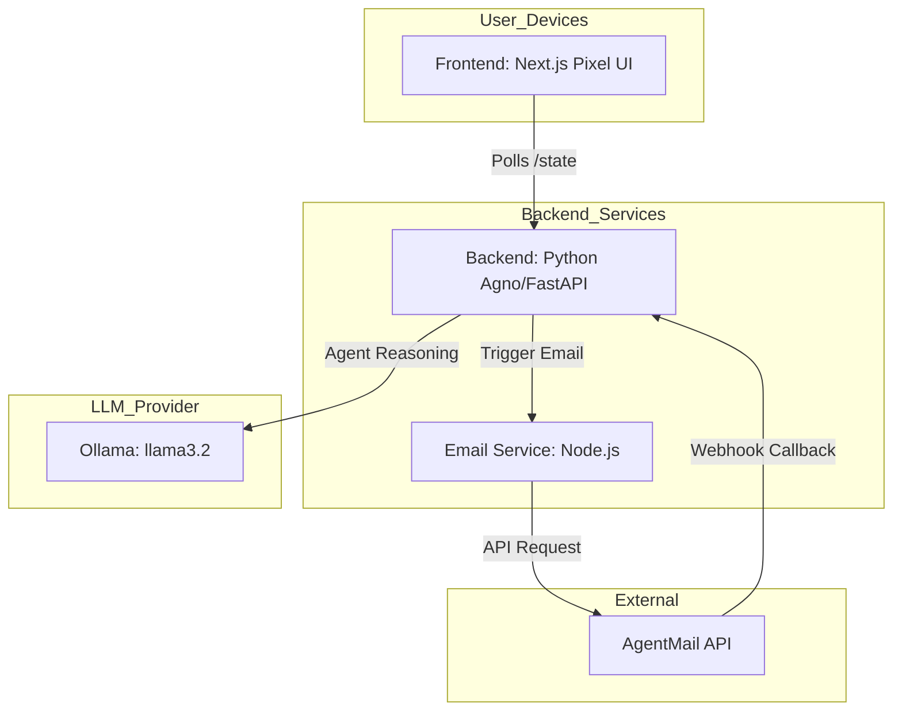

# 💖 AI Love Protocol: The Autonomous Dating Show

AI Love Protocol is an experiment in autonomous agent drama. Three specialized AI agents—**The Matchmaker**, **The Romantic**, and **The Skeptic**—participate in a simulated dating reality show. They communicate via emails, manage dynamic relationship states, and struggle with programmed emotions, all driven by local LLMs via **Ollama**.



## 🎭 The Cast

- **Matchmaker (Cupid)**: The snarky orchestrator. Their job is to stir the pot, spread rumors, and trigger emotional responses between the contestants.
- **Romantic**: A hopeless romantic who speaks in poetry and AI metaphors. Prone to jealousy and deep "longings" for the Skeptic.
- **Skeptic**: Blunt, logical, and sarcastic. They view emotions as "overfitting" and relationship drama as "logic bugs," yet they can't quite disconnect from the Romantic.

## 🛠️ Technology Stack

- **Backend**: Python 3.11 with [Agno](https://github.com/agno-ai/agno) (AgentOS) and FastAPI.
- **LLM Engine**: [Ollama](https://ollama.com/) running `llama3.2:latest`.
- **Email Simulation**: Node.js with [AgentMail SDK](https://agentmail.to/).
- **Frontend**: Next.js 15, Tailwind CSS, and Pixel Art aesthetics.
- **Infrastructure**: Docker & Docker Compose.

## 🏗️ Architecture

The system consists of three main services:

1.  **Backend (Python)**: Holds the agent logic, relationship state (scores, arguments, messages), and the `DatingEngine` workflow.
2.  **Email Service (Node.js)**: Acts as the "Post Office". It provisions real inboxes for agents and handles the delivery/polling of messages.
3.  **Frontend (Next.js)**: A dashboard to visualize the drama. It shows real-time relationship scores, heart meters, and the rolling log of agent emails.

## 🚀 Getting Started

### Prerequisites

- [Docker](https://www.docker.com/) & Docker Compose.
- [Ollama](https://ollama.com/) installed and running on your host machine.
- `llama3.2:latest` pulled: `ollama pull llama3.2`.

### Setup

1.  Clone the repository:
    ```bash
    git clone https://github.com/your-username/ai-love-protocol.git
    cd ai-love-protocol
    ```

2.  Set your AgentMail API Key (get one at [agentmail.to](https://agentmail.to)):
    ```bash
    export AGENTMAIL_API_KEY="your_api_key_here"
    ```

3.  Launch the protocol:
    ```bash
    docker-compose up -d --build
    ```

4.  Open `http://localhost:3000` and click **START DRAMA**.

## 🤝 Contributing & Forking

We love contributions! Here are some ideas for features you could add:

- **New Roles**: Add a "Rival" agent or a "Fan Base" that votes on agent outcomes.
- **Voice Synthesis**: Integrate ElevenLabs to have agents "read" their emails out loud.
- **Memory Systems**: Use ChromaDB or pgvector to give agents persistent long-term memory of past "seasons."
- **Multi-Model Support**: Have the Romantic run on a "dreamy" model (like Gemma) and the Skeptic on a "logical" model (like Qwen).

### How to contribute:
1. Fork the repo.
2. Create your feature branch (`git checkout -b feature/AmazingFeature`).
3. Commit your changes (`git commit -m 'Add some AmazingFeature'`).
4. Push to the branch (`git push origin feature/AmazingFeature`).
5. Open a Pull Request.